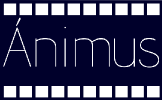

Ánimus(2D SVG Animator)
===================

##Descripción
Ánimus es un creador y editor de animaciones en 2D que utiliza SVG (Scalar Vector Graphics). Permite importar y editar imágenes para utilizarlas en animaciones. Además, de una forma intuitiva y minimalista, busca facilitar al usuario la creación de la animación. Cuenta además el programa con una línea de tiempo cuadro a cuadro, donde se podrán sincronizar: Las imágenes en SVG y la/s pistas de audio.

##Ficha técnica

###Plataformas de destino
Windows 7
Windows 8
Ubuntu 14.10

###Audiencia
Ánimus va dirigido especialmente a aquellas personas aficionadas a la animación en 2D, que tengan deseos de contar una historia animada pero no encuentran un software que combine la simpleza de una interfaz con la potencia de los gráficos vectoriales. Sin embargo, ánimus también será del agrado de aquellos animadores digitales con experticia que deseen simplificar su trabajo en la creación de animaciones cuadro por cuadro.

###Productos similares
La mayoría de softwares en circulación para la creación de animación 2D de calidad son de licencias privativas, ejemplo de ello el tan usado (y de mala calidad) Flash, o los grandes softwares de animación japonesa que o bien por su precio o por el idioma en que están diseñados resultan de difícil acceso.

Existe software gratuito, muestra de ello es Pencil o Synfig Studio, sin embargo estos softwares no son lo suficientemente intuitivos para ser usados por una persona sin conocimientos técnicos sobre animación digital.

Por otro lado, SVG ha sido propuesto como estándar por la W3C. Sin embargo no existen herramientas que permitan su fácil creación para ser insertado en páginas web.

1. [Skencil](http://www.skencil.org/)
    Su desarrollo está detenido. La última versión estable es del 2008 y la última versión de prueba es del 2010. Solo está disponible para linux.
     
2. [Synfig](http://www.synfig.org/cms/)

3. [Pencil](http://www.pencil-animation.org/)

4. [Beez](http://beez.sourceforge.net/)

5. [MvComicsMaker](http://mvcm.sourceforge.net/documentation.html)

6. [Tupi](http://www.maefloresta.com/portal/about)

7. [theTAB](http://www.the-tab.com/index.htm)
	De pago. Tiene versiones para niños. El precio de la licencia va desde $40 por la versión infantil hasta $200 por la versión profesional completa.  

8. [Moho](http://www.lostmarble.com/moho/screens.shtml)
	Parece estar descontinuado. Parece tener soporte para animar “Esqueletos”. 

9. [Anime Studio](http://anime.smithmicro.com/index.html)
	De pago. La lincencia de la versión “Debut” cuesta $49.99 ; la de la versión “Pro”, $299.99. Es un software muy completo, con soporte para esqueletos. Un video tutorial que muestra claramente las capacidades de este programa puede ser encontrado [aquí](https://www.youtube.com/watch?v=h8aC6YYlwjE#t=59).

##Antecedente
Es importante crear un software de Animación Digital 2D, libre y con soporte para gráficos vectoriales dado que no hay ningúno actualmente que cumpla con estas características. Los programas más poderosos para realizar animación digital trabajan con licencias privativas que en la mayoría de los casos los aficionados a las animaciones no pueden costear.
Además se busca simplificar la interfaz para que una persona sin conocimientos técnicos sobre animación digital pueda crear sus pequeñas historias.

##Modelo
En general, una vez descritos un elementos de la imagen en svg, el trabajo matemático se reduce a localizar dado elemento en el tiempo y espacio. Por otro lado, el estándar svg define todos los objetos que es posible crear utilizándolo.

En el caso de las imágenes rasterizadas, la rotación, el redimensionado y la aplicación de algunos efectos requiere el uso de matrices.

Sin embargo, para lo anterior se utilizarán librerías de renderizado de svg. Posiblemente la librería utilizada sea [cairo](http://cairographics.org/)

##Controles. 
Será posible importar imágenes rasterizadas y vectoriales, video y sonido. Para definir la trayectoria de una imagenn en la animación el usuario dibuja líneas o curvas. Para controlar el tiempo en que ocurre el desplazamiento a través de la trayectoria se utiliza la línea de tiempo. De forma similar, para la rotación de los objetos se selecciona gráficamente un punto con respecto al cual rotar y la magnitud de la rotación, mientras que el tiempo de la rotación se controla en la línea de tiempo. El control del sonido también se hace mediante la línea del tiempo.

Además de los desplazamientos y los giros, la línea de tiempo debe poder representar cambios instantáneos de posición y de rotación. Además, la visibilidad de una imagen también debe poder ser modificada instantáneamente.

Eventualmente puede añadirse al Ánimus la capacidad de modificar otras propiedades de la imagen. Entre ellas el color, la transparencia y el tamaño.

Debe existir una forma de asociar varias imágenes para que puedan moverse juntas. En este caso, sería necesario definir sus movimientos de forma relativa a la imagen a la que están asociadas.

Ánimus NO tiene la capacidad de editar ni crear ningún tipo de imagen ni sonido. Todos deben ser importados. Sin embargo, Ánimus debe tener la capacidad de empezar a reproducir una animación o un archivo de sonido en cualquier punto, así como a terminar la reproducción antes de que termine el archivo y a crear repeticiones de sonido y animaciones.

##Salida
La animación puede ser pausada, detenida, adelantada, atrasada, acelerada o desacelerada. Para ello se utilizarán botones con la simbología tradicional.

Debería haber por lo menos dos modos de animación. Uno de ellos debe mostrar las trayectorias y las rotaciones para facilitar el desarrollo. El otro debe mostrar la animación como sería vista terminada.

##Resultados
ánimus debería tener dos tipos de resultado. Uno es un archivo SVG que pueda ser insertado en páginas web. Este archivo SVG animado puede ser visto en casi cualquier navegador.

El segundo tipo de resultado son archivos de video en formatos de video comunes como AVI o MPEG.
